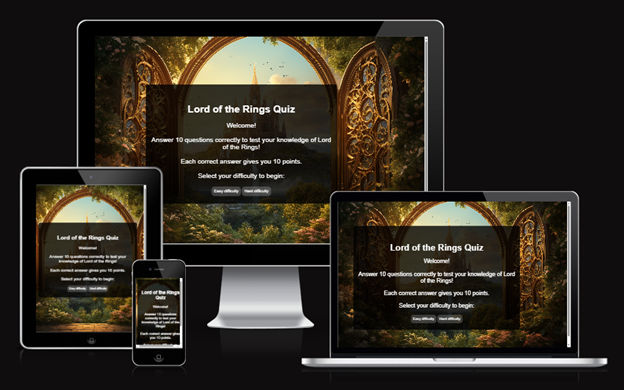

# Lord-of-the-Rings-Quiz

Test your Middle-earth knowledge and prove you're worthy of the Fellowship!
J.R.R. Tolkien’s The Lord of the Rings is one of the most beloved fantasy sagas of all time, inspiring millions of fans across the world. From the Eriador to Mordor, the stories of Frodo, Gandalf, Aragorn, and countless other legendary characters have captivated readers and moviegoers for decades. But how well do they know Middle-earth?

This Lord of the Rings Quiz was created to challenge fans, allowing them to test their knowledge anywhere, anytime. Are you ready to embark on this adventure? Take the quiz and see if you have what it takes to be a true Lord of the Rings master! 

---

()

Lord of the rings Website is live, to access it click [here](https://madlp345.github.io/Lord-of-the-Rings-Quiz/).

## Table of Contents

1. [User Experience (UX)](#user-experience-ux)
   - [User Stories](#user-stories)
   - [Design](#design)
2. [Features](#features)
3. [Technologies Used](#technologies-used)
4. [Testing](#testing)
5. [Deployment](#deployment)
6. [Credits](#credits)
7. [Acknowledgments](#acknowledgments)

---

## User Experience (UX)

### Site Purpose
The Lord of the Rings Quiz was created for fans of J.R.R. Tolkien’s legendary world to test their knowledge in a fun and interactive way. Whether you're a casual movie watcher or a dedicated reader of The Silmarillion, this quiz offers a challenge for everyone.

#### First Time Visitor Goals
- I want to test my Lord of the Rings knowledge in a fun and interactive way.
- I want the site to be easy to navigate, so I can start the quiz quickly without any confusion.
- I want the quiz to work smoothly on any device, whether I'm playing on my phone, tablet, or computer.

#### Frequent Visitor Goals
- I want to adjust the difficulty level so I can continue challenging myself and improving my knowledge of Middle-earth.
- I want to track my high scores to see my progress over time and aim for a better score with each attempt.
- I want to compete with myself and others, testing my expertise and striving to become a true Lord of the Rings master.

---

## Design

### Color Scheme

As the pages of the site have a background image, the color scheme was kept minimal to avoid overwhelming users. White, and shades of grey create a minimalist aesthetic, ensuring readability and contrast.

- **Primary Colors**: #FFFFFF (white) for text and hover.
- **Overlay Color**: #25221F for the quiz background image overlay.
- **Highlight Color**: #50514E for buttons  backgrounds.

### Typography
- **Font Family**: Cormorant Unicase (imported from Google Fonts)

### Imagery
As the website is a quiz based on the Middle-earth, I wanted to use one of the art inspired by the books. 

### Wireframes
Wireframes were created for mobile, tablet and desktop using balsamiq.

---

## Features

### Existing Features

### Future Features

---

## Testing

### Challenges & Solutions

### Validator Testing
- **HTML Validator**: 

- **CSS Validator**: 

- **Lighthouse Accessibility Score**:  

- **Cross-Browser Testing**: 
- **No broken links** 

## Manual Testing

### Unfixed Bugs

---

## Technologies Used

### Programming Languages
- HTML5
- CSS
- JavaScript

### Frameworks, Libraries & Tools
- **Google Fonts** – Tinos font.
- **Font Awesome** – Icons for navbar and footer.
- **GitPod/CodeAnywhere** – Development environment.
- **GitHub** – Repository hosting.
- **Am I Responsive?** – Responsive design testing.
- **Balsamiq** – Wireframe design.

---

## Deployment

The site was deployed to **GitHub Pages**.

### Deployment Steps
1. Navigate to the **GitHub repository** and go to the **Settings** tab.
2. On the left-hand side menu, go to **Pages**.
3. Under **Build and Deployment**, select **Main Branch**.
4. Once selected, the page refreshes, and a ribbon displays the **successful deployment** message.
5. **Live link:** [Lord of the Rings Quiz](https://madlp345.github.io/Lord-of-the-Rings-Quiz/index.html)

---

## Credits

### Code
- Mentor **Jubril Akolade** recommended using Bootstrap.

### Media
- All images were provided by the restaurant owner:
  - **Juan Jose Currea**
  - **Email**: casablancacapital@outlook.com

---