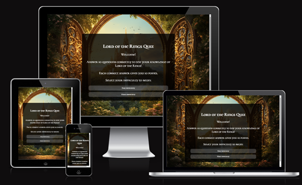

# Lord-of-the-Rings-Quiz

Test your Middle-earth knowledge and prove you're worthy of the Fellowship!
J.R.R. Tolkien’s The Lord of the Rings is one of the most beloved fantasy sagas of all time, inspiring millions of fans across the world. From the Eriador to Mordor, the stories of Frodo, Gandalf, Aragorn, and countless other legendary characters have captivated readers and moviegoers for decades. But how well do they know Middle-earth?

This Lord of the Rings Quiz was created to challenge fans, allowing them to test their knowledge anywhere, anytime. Are you ready to embark on this adventure? Take the quiz and see if you have what it takes to be a true Lord of the Rings master! 

---

()

Lord of the rings Website is live, to access it click [here](https://madlp345.github.io/Lord-of-the-Rings-Quiz/).

## Table of Contents

1. [User Experience (UX)](#user-experience-ux)
   - [User Stories](#user-stories)
   - [Design](#design)
2. [Features](#features)
3. [Technologies Used](#technologies-used)
4. [Testing](#testing)
5. [Deployment](#deployment)
6. [Credits](#credits)
7. [Acknowledgments](#acknowledgments)

---

## User Experience (UX)

### Site Purpose
The Lord of the Rings Quiz was created for fans of J.R.R. Tolkien’s legendary world to test their knowledge in a fun and interactive way. Whether you're a casual movie watcher or a dedicated reader of The Silmarillion, this quiz offers a challenge for everyone.

#### First Time Visitor Goals
- I want to test my Lord of the Rings knowledge in a fun and interactive way.
- I want the site to be easy to navigate, so I can start the quiz quickly without any confusion.
- I want the quiz to work smoothly on any device, whether I'm playing on my phone, tablet, or computer.

#### Frequent Visitor Goals
- I want to adjust the difficulty level so I can continue challenging myself and improving my knowledge of Middle-earth.
- I want to track my high scores to see my progress over time and aim for a better score with each attempt.
- I want to compete with myself and others, testing my expertise and striving to become a true Lord of the Rings master.

---

## Design

### Color Scheme

As the pages of the site have a background image, the color scheme was kept minimal to avoid overwhelming users. White, and shades of grey create a minimalist aesthetic, ensuring readability and contrast.

- **Primary Colors**: #FFFFFF (white) for text and hover.
- **Overlay Color**: #25221F for the quiz background image overlay.
- **Highlight Color**: #50514E for buttons  backgrounds.

### Typography
- **Font Family**: Cormorant Unicase (imported from Google Fonts)

### Imagery
As the website is a quiz based on the Middle-earth, I wanted to use one of the art inspired by the books. 

### Wireframes
Wireframes were created for mobile, tablet and desktop using balsamiq.

---

## Features

The website is comprised of a home page that also works as the game page and a high score page.
- A favicon in the browser
 

-Every page will display a custom cursor after you answer a question. 

- The Home Page
The home page of the Lord of the Rings Quiz a container which holds the title and explains the visitor how to play. Below this are two buttons easy difficulty and hard difficulty.

 
Once the user has selected their difficulty they will then be shown the quiz area. The quiz area contains the question and the 4 answer choices.

- The Game Page
 
When a user selects an answer, they will then be prevented from selecting any more answers and icon will appear. The quiz area border and the button selected will change styles depending on whether the answer selected was correct or incorrect. If the answer selected was correct, the score counter will add 10 to the score total. When the user clicks the next button the question counter will increase by 1. If the user selects the wrong answer, the button selected will display red, and the correct answer will display as green. Also when the user answer selects an answer the next button will appear.

- End of the Quiz
 
Once a user has answered the 10 questions they will be taken to the end of the game which will allow them to enter their name and submit the result will be entered onto the high scores page. The send button checks if there is a name, if there isn´t any info a Sweet Alert pop up message will alert the user that is needed to fill the name.

---

## Testing

### Future Features

In future implementations I would like to:

  1. Expand the array of questions and randomize their order.
  2. Add some videos in some questions so they have to identify the moment or the characters.
  3. Create a new categories like movies vs books or time based challenges

---

### Validator Testing
- **HTML Validator**: The error "Duplicate attribute class" means that in your HTML code, some elements (likely <button> elements) have multiple class attributes defined on the same tag, which is not allowed in HTML but is used to over pass the other previous classes. 

- **CSS Validator**:  Passed all checks. 

- **Lighthouse Accessibility Score**: Page has good performance and accessibility 

- **Cross-Browser Testing**: Works in Chrome, Safari, and Mozilla.
- **No broken links found** 

## Manual Testing

The following table outlines the manual testing performed for the portfolio website:

| Test Case | Steps to Reproduce | Expected Result | Actual Result | Status (Pass/Fail) |
|-----------|-------------------|----------------|--------------|----------------|
| **Page Loads Successfully** | Open the quiz URL in a web browser | The quiz homepage loads without errors, displaying the first question | Works correctly | Pass |
| **Start Quiz Button** | Click the "Start Quiz" button (if applicable) | The first question appears with answer choices | Works correctly | Pass |
| **Answer Selection** | Click on an answer option | The selected answer is highlighted, and feedback (correct/incorrect) is displayed | Works correctly | Pass |
| **"Next" Button Navigation** | Click the "Next" button after selecting an answer | The next question appears | Works correctly | Pass |
| **Score Tracking** | Answer multiple questions correctly and incorrectly | The score updates based on correct answers | Score updates correctly | Pass |
| **Quiz Completion** | Answer all questions | The quiz displays the final score and an option to restart | End screen appears | Pass |
| **Restart Quiz** | Click the "Restart" or "Play Again" button | The quiz resets to the first question with a score of 0 | Quiz resets successfully | Pass |
| **Local Storage High Scores** | Complete the quiz, check if the score is saved, refresh the page | High scores persist after refresh | High scores are saved | Pass |
| **Responsive Design** | Open the quiz on different screen sizes (mobile, tablet, desktop) | The quiz layout adapts correctly without breaking UI | Works on all devices | Pass |
| **Broken Links & Navigation** | Click any links (e.g., Home, Restart) | The links navigate to the correct pages without errors | No broken links | Pass |

### Unfixed Bugs
 
The error indicates that the code is expecting a <tbody> element within a table with the ID tablaPuntajes. Since the element is created dynamically, it will be null until a score is loaded.

---

## Technologies Used

### Programming Languages
- HTML5
- CSS
- JavaScript

### Frameworks, Libraries & Tools
- **Google Fonts** – Tinos font.
- **Font Awesome** – Icons for navbar and footer.
- **VS Code** – Development environment.
- **GitHub** – Repository hosting.
- **Am I Responsive?** – Responsive design testing.
- **Balsamiq** – Wireframe design.
- **Google Developer Tools** - To troubleshoot and test features, solve issues with responsiveness and styling.
- **jQuery** - A JavaScript library.
---

## Deployment

The site was deployed to **GitHub Pages**.

### Deployment Steps
1. Navigate to the **GitHub repository** and go to the **Settings** tab.
2. On the left-hand side menu, go to **Pages**.
3. Under **Build and Deployment**, select **Main Branch**.
4. Once selected, the page refreshes, and a ribbon displays the **successful deployment** message.
5. **Live link:** [Lord of the Rings Quiz](https://madlp345.github.io/Lord-of-the-Rings-Quiz/index.html)

### Contents
All the questions for my site were created by my knowledge of the middle-earth and the Lord of the Rings saga.

### Media
- [Background page](https://www.google.com/url?sa=i&url=https%3A%2F%2Finsighttimer.com%2FAlexandraG&psig=AOvVaw1CGqMKU6rPS3tMhOEJpIPE&ust=1743646077276000&source=images&cd=vfe&opi=89978449&ved=0CBAQjRxqFwoTCNiK3vuhuIwDFQAAAAAdAAAAABAE)
---

## Credits
Here’s a revised version of your "Code Used" section based on the new links you provided:  

---

### Code Used  

The following YouTube tutorials were instrumental in developing various features of the [Lord of the Rings Quiz](https://madlp345.github.io/Lord-of-the-Rings-Quiz/):  

* **Modal for Instructions:**  
  To create a modal for the "How to Play" section, I followed [this YouTube tutorial](https://www.youtube.com/watch?v=PBcqGxrr9g8), which provided a step-by-step guide on building and styling modals with JavaScript.  

* **Shuffling Quiz Answers:**  
  Since the API used for the quiz provided a separate correct answer along with an array of incorrect answers, I needed to shuffle the answers so the correct one wouldn’t always appear in the same position. My research led me to the **Fisher-Yates Shuffle**, which ensures an even probability distribution. I adapted the method using insights from [this tutorial](https://www.youtube.com/watch?app=desktop&v=k8yJCeuP6I8&t=0s).  

* **Local Storage for High Scores:**  
  The Code Institute Diploma’s JavaScript modules did not cover local storage, so I researched how to store and retrieve high scores myself. I followed [this tutorial](https://www.youtube.com/watch?v=PDzB2hI0esQ) to learn how to:  
  - Save player names and scores into an array stored in local storage.  
  - Sort the scores in descending order.  
  - Use a predefined maximum number of scores (e.g., `MAX_HIGH_SCORES`) to limit the stored data.  

These resources helped me effectively implement key functionalities in the quiz application.
## Acknowledgments

- **Jubril Akolade** My Code Institute Mentor.
-  [Oscar Nain Borja Cruz](https://co.linkedin.com/in/oscar-borja-stts) - He is one of my parents best friend and he took the time to walk through my code with me when I was struggling with adding event listeners.
- **The Code Institute Slack channel Peer Code Review** - There were similar cases from the ones I was facing. 
---